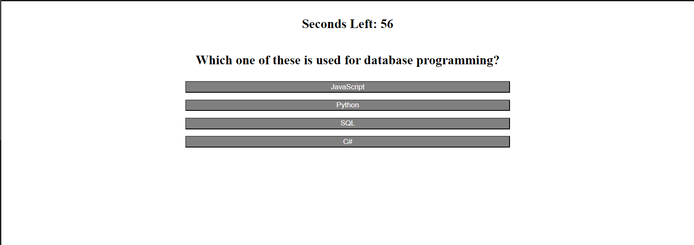

# 04-code-quiz
## Description
This is a code quiz. The user answers multiple choice questions by clickcing on the button that corresponds to the answer. The quiz has a 60 second timer. clicking the wrong answer will deduct 3 seconds from the timer. The quiz ends if the user answers all questions or if time runs out. The quiz keeps score and allows the user to record their score on the leaderboard.
## Installation 
N/A  
## Usage
The user starts at the start page. Clicking the start button will present the first question.
They will see a question and 4 buttons with answer choices. They click the button of the answer they think is correct. The next question will display and if the answer the user chose was wrong, the timer will deduct 3 seconds. At the end of the quiz the user will be shown their score. They can enter their intiails in the present text area and they will see their score go on the leaderboard. In the leaderboard the user can press the go back button to restart the quiz or clear the scores.
Link to the deployed application: https://pconenna.github.io/04-code-quiz/

## Screenshots

## Credits 
I attended a tutoring session with Vinnie Lopez. 
### Changes made:
using an array of objects instead of an object of objects to store the questions

attaching the checkAnswer function to button event handlers

changing the stucture of the nextQuestion and checkAnswer functions
### Outside sources
I got the line of code that sorts the scores array from https://devsheet.com/sort-array-of-objects-by-key-value-in-javascript/ 
## License 
Please refer to the license in the repo.